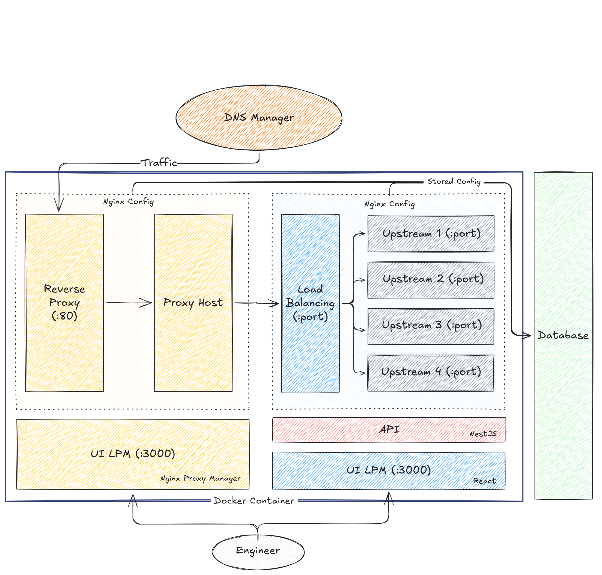

# NPM Load Balancer

> A web-based Nginx Load Balancer management system built on top of [Nginx Proxy Manager](https://nginxproxymanager.com/).

Built with **NestJS** (backend) and **React/Vite** (frontend), running as an additional service inside the NPM container via **s6-overlay**.

[](./LICENSE)
[](https://www.docker.com/)
[](./CONTRIBUTING.md)

---

## Table of Contents

- [Overview](#overview)
- [Architecture](#architecture)
- [Features](#features)
- [Prerequisites](#prerequisites)
- [Quick Start](#quick-start)
- [Environment Variables](#environment-variables)
- [How startScript.sh Works](#how-startscriptsh-works)
- [Project Structure](#project-structure)
- [CI/CD (GitLab)](#cicd-gitlab)
- [Local Development](#local-development)
- [Contributing](#contributing)
- [Troubleshooting](#troubleshooting)
- [License](#license)

---

## Overview

NPM Load Balancer extends Nginx Proxy Manager with a dedicated UI and API for managing upstream load balancing configurations. Instead of manually editing Nginx config files, you manage your upstream servers through a visual dashboard � the system handles config generation, validation, and reload automatically.

---

## Architecture



1. Users manage load balancers via the **dashboard UI** or directly through the **REST API**.
2. The backend persists all configuration to **PostgreSQL** via **Prisma ORM**.
3. The backend applies advanced load balancing topologies (e.g. least connections, IP Hash, active/inactive states).
4. Auto-generates **Nginx `.conf`** files from the stored configuration.
5. Nginx config is validated and reloaded automatically on every change.

---

## Features

| Feature | Description |
|---|---|
| **Visual Dashboard** | Create, edit, duplicate, and delete load balancers through a clean UI |
| **Advanced Load Balancing Alg** | Distribute via Round Robin, Least Connections, IP Hash, or Custom Weighting |
| **Active / Inactive Toggle** | Pause/resume distribution directly without deleting configs |
| **Multi-Upstream Support** | Configure multiple backend servers with protocol support (HTTP/HTTPS) and `backup` modes |
| **Passive Health Checks** | Per-upstream `max_fails` and `fail_timeout` settings, integrated natively into Nginx via Failover options |
| **Config Preview** | View raw Nginx `.conf` syntax directly in the GUI before saving |
| **PostgreSQL Backend** | Persistent, robust storage via an external PostgreSQL database |
| **Auto Environment Setup** | `startScript.sh` automatically builds connection strings and runs schema migrations on boot |
| **CI/CD Ready** | GitLab CI/CD pipeline included for build and deployment |

---

## Prerequisites

- **Docker** >= 20.10
- **Docker Compose** >= 2.0
- **PostgreSQL** >= 13 (external � not bundled in this stack)
- Available ports: `80`, `81`, `443`, `3000`

---

## Quick Start

### 1. Configure environment

```bash
cp env.example src/app/.env
```

Open `src/app/.env` and fill in your PostgreSQL credentials.

### 2. Start the stack

```bash
docker compose up -d --build
```

### 3. Access the services

| Service | URL |
|---|---|
| Load Balancer UI | `http://localhost:3000` |
| NPM Admin Panel | `http://localhost:81` |

---

## Environment Variables

These variables can be set in `docker-compose.yml` or as GitLab CI/CD variables.

| Variable | Default | Required | Description |
|---|---|---|---|
| `POSTGRES_HOST` | � | Yes | Hostname of your external PostgreSQL server |
| `POSTGRES_PORT` | `5432` | | PostgreSQL port |
| `POSTGRES_USER` | � | Yes | Database username |
| `POSTGRES_PASSWORD` | � | Yes | Database password |
| `POSTGRES_DB` | � | Yes | Database name |
| `TZ` | `Asia/Jakarta` | | Container timezone |
| `NODE_ENV` | `production` | | App mode (`production` or `development`) |

> **Note:** If `POSTGRES_PASSWORD` contains special characters (e.g. `@`, `#`, `/`), make sure the value is URL-encoded to avoid breaking the `DATABASE_URL` connection string.

---

## How startScript.sh Works

`startScript.sh` runs as the container entrypoint and handles three things automatically on every container start:

1. **Generates `.env`** � Builds `DATABASE_URL` dynamically from the `POSTGRES_*` environment variables.
2. **Runs database migration** � Executes `prisma db push` to keep the schema in sync.
3. **Portable** � The same script works locally for quick setup without any manual configuration.

---

## Project Structure

```
npm-custom-lb/
+-- config/                  # Runtime data mounted into the container
�   +-- data/                # Mount point for /data (Nginx configs)
�   +-- letsencrypt/         # SSL certificates
+-- gitlab-ci/               # CI/CD pipeline scripts (build & deploy)
+-- src/
�   +-- app/                 # Backend � NestJS
�   +-- frontend/            # Frontend � React + Vite
+-- Dockerfile               # Multi-stage Docker build
+-- docker-compose.yml       # Container orchestration
+-- startScript.sh           # Entrypoint: env generation & DB migration
+-- env.example              # Environment variable template
```

---

## CI/CD (GitLab)

The pipeline runs in two stages:

**Stage 1 � Build**
Builds the Docker image using the multi-stage `Dockerfile` and pushes it to the GitLab Container Registry.

**Stage 2 � Deploy**
SSHes into the target server, runs `docker compose pull` to fetch the latest image, then restarts the stack with the updated environment variables.

**Required GitLab CI/CD Variables** (`Settings ? CI/CD ? Variables`):

- `POSTGRES_HOST`
- `POSTGRES_USER`
- `POSTGRES_PASSWORD`
- SSH credentials for your deployment server

---

## Local Development

### 1. Export environment variables

```bash
export POSTGRES_HOST=localhost
export POSTGRES_PORT=5432
export POSTGRES_USER=youruser
export POSTGRES_PASSWORD=yourpassword
export POSTGRES_DB=yourdb
```

### 2. Generate `.env` and run migrations

```bash
./startScript.sh
```

### 3. Start the backend

```bash
cd src/app
npm install
npm run start:dev
# Runs on http://localhost:3001
```

### 4. Start the frontend (separate terminal)

```bash
cd src/frontend
npm install
npm run dev
# Runs on http://localhost:5173
```

---

## Contributing

Contributions are welcome! Here's how to get started:

1. Fork this repository.
2. Create a new branch: `git checkout -b feature/your-feature-name`
3. Make your changes and commit: `git commit -m 'feat: add some feature'`
4. Push to your branch: `git push origin feature/your-feature-name`
5. Open a Pull Request.

Please make sure your code follows the existing style and that all services start correctly before submitting.

---

## Troubleshooting

### Cannot connect to the database

- Verify that your PostgreSQL host is reachable from inside the container.
- Check if the password contains special characters that need URL encoding.
- Inspect the container logs:
  ```bash
  docker compose logs -f npm-lb
  ```

### `.env` file is stale or not updated

Delete the old file and restart the container to let `startScript.sh` regenerate it:

```bash
rm src/app/.env
docker compose restart
```

### Nginx reload fails

Validate the generated Nginx config syntax:

```bash
docker compose exec npm-lb nginx -t
```

The output will point to the exact line causing the syntax error.

---

## License

[MIT](./LICENSE) � NPM Load Balancer Contributors


